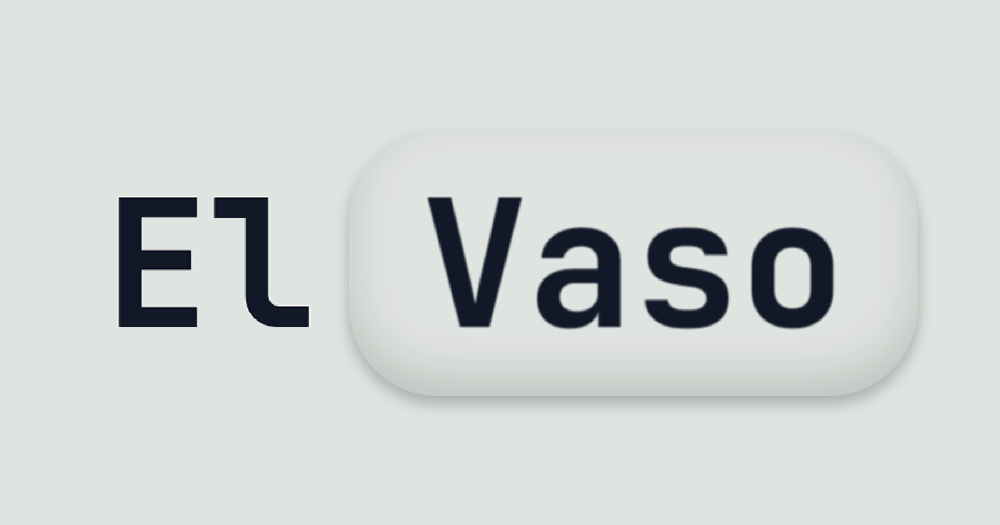

# Vaso

A beautiful liquid glass distortion effect component for React that creates stunning visual magnification and warping effects.

Vaso is the React version of [shuding](https://github.com/shuding)'s [Liquid Glass](https://github.com/shuding/liquid-glass) implementation.



## Installation

```bash
npm add vaso
```

## Quick Start

```tsx
import { Vaso } from 'vaso'

function App() {
  return (
    <div>
      <h1>Some content here</h1>
      <p>This text will be distorted by the glass effect</p>
      
      <Vaso
        px={20}
        py={20}
        borderRadius={15}
        scale={1.2}
        blur={0.5}
      />
    </div>
  )
}
```

## API Reference

### Props

| Prop | Type | Default | Range | Description |
|------|------|---------|-------|-------------|
| `children` | `React.ReactNode` | **required** | - | The content to render inside the glass (typically a transparent div for sizing) |
| `width` | `number` | `undefined` | - | Explicit width of the glass element (overrides child element size) |
| `height` | `number` | `undefined` | - | Explicit height of the glass element (overrides child element size) |
| `px` | `number` | `0` | `0-100` | Horizontal padding around the glass effect |
| `py` | `number` | `0` | `0-100` | Vertical padding around the glass effect |
| `borderRadius` | `number` | `0` | `0-∞` | Border radius of the glass container |
| `scale` | `number` | `1.0` | `-2.0 to 2.0` | Distortion scale intensity (negative values create compression) |
| `blur` | `number` | `0.25` | `0-10` | Blur amount applied to the background |
| `contrast` | `number` | `1` | `0-1.0` | Contrast adjustment (1 = normal, >1 = more contrast) |
| `brightness` | `number` | `1.0` | `0-2.0` | Brightness adjustment (1 = normal, >1 = brighter) |
| `saturation` | `number` | `1.0` | `0-2.0` | Saturation adjustment (1 = normal, >1 = more saturated) |
| `distortionIntensity` | `number` | `0.15` | `-1.0 to 1.0` | Intensity of the distortion effect (negative values invert effect) |
| `roundness` | `number` | `0.6` | `-1.0 to 1.0` | Roundness of the distortion shape (negative values invert roundness) |
| `shapeWidth` | `number` | `0.3` | `-1.0 to 1.0` | Width of the distortion shape (negative values invert horizontally) |
| `shapeHeight` | `number` | `0.2` | `-1.0 to 1.0` | Height of the distortion shape (negative values invert vertically) |
| `draggable` | `boolean` | `false` | - | Whether the glass can be dragged around |
| `initialPosition` | `{ x: number; y: number }` | `{ x: 300, y: 200 }` | - | Initial position for draggable glass |
| `onPositionChange` | `(position: { x: number; y: number }) => void` | `undefined` | - | Callback when glass position changes |

### Negative Values Support

Vaso supports negative values for several parameters to create inverted effects:

- **`scale`** (`-2.0 to 2.0`): Negative values create compression instead of magnification
- **`distortionIntensity`** (`-1.0 to 1.0`): Negative values invert the distortion direction
- **`roundness`** (`-1.0 to 1.0`): Negative values create inverted roundness effects
- **`shapeWidth`/`shapeHeight`** (`-1.0 to 1.0`): Negative values flip the distortion horizontally/vertically

## Examples


### Basic Glass Effect

```tsx
<Vaso
  className="w-48 h-36 bg-transparent"
  px={20}
  py={20}
  borderRadius={12}
  scale={1.5}
  blur={0.3}
/>
```

### Glass with Explicit Dimensions

```tsx
<Vaso
  className="w-48 h-36 bg-transparent"
  width={300}
  height={200}
  px={20}
  py={20}
  borderRadius={12}
  scale={1.5}
  blur={0.3}
/>
```

### Draggable Glass with Callbacks

```tsx
function DraggableGlass() {
  const [position, setPosition] = useState({ x: 100, y: 100 })
  
  return (
    <Vaso
      draggable
      initialPosition={position}
      onPositionChange={setPosition}
      px={15}
      py={15}
      borderRadius={20}
      scale={1.2}
      blur={0.4}
      contrast={1.3}
    />
  )
}
```

### High Distortion Effect

```tsx
<Vaso
  className="w-48 h-36 bg-transparent"
  px={30}
  py={30}
  scale={2.0}
  distortionIntensity={0.35}
  roundness={0.8}
  shapeWidth={0.4}
  shapeHeight={0.3}
  blur={0.6}
  contrast={1.5}
  brightness={1.1}
  saturation={1.2}
/>
```

## License

MIT

