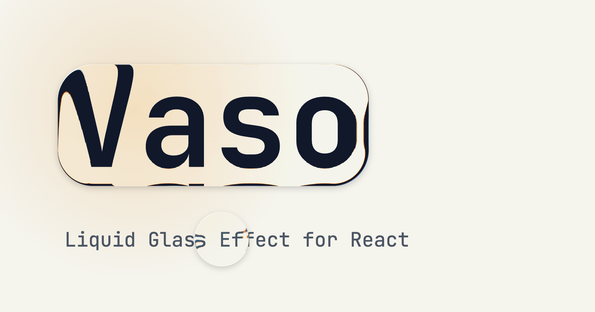

# Vaso

A beautiful liquid glass distortion effect component for React that creates stunning visual magnification and warping effects.



## Installation

```bash
npm add vaso
```

## Quick Start

```tsx
import { Vaso } from 'vaso'

function App() {
  return (
    <Vaso radius={16} depth={1.2} blur={0.5} outset={12}>
      <p>This text sits under a liquid glass</p>
    </Vaso>
  )
}
```

## API Reference

### Props

| Prop | Type | Default | Range | Description |
|------|------|---------|-------|-------------|
| `children` | `React.ReactNode` | - | - | Content rendered on top of the glass. Without children, set `width` and `height` to size the glass |
| `component` | `string \| React.ComponentType` | `'div'` | - | The element or component to render as the glass root, e.g. `'span'` for inline glass |
| `width` | `number` | `undefined` | - | Explicit width of the glass element (overrides child element size) |
| `height` | `number` | `undefined` | - | Explicit height of the glass element (overrides child element size) |
| `outset` | `number \| { x, y, top, right, bottom, left }` | `0` | - | Extends the glass beyond the element without affecting layout. A number applies to every side; sides take precedence over axes |
| `px` / `py` | `number` | `0` | - | **Deprecated**, use `outset={{ x, y }}` |
| `radius` | `number` | inherited | `0-∞` | Border radius of the glass. Defaults to the element's computed `border-radius`, so classes like `rounded-full` just work |
| `depth` | `number` | `0` | `-5.0 to 5.0` | Refraction strength at the bezel (negative values create a concave, compressing glass) |
| `blur` | `number` | `0.1` | `0-10` | Backdrop blur in pixels |
| `dispersion` | `number \| false` | `0.5` | `0-3.0` | Spectral (rainbow) dispersion along the refracting edge, like Figma's glass. Scales with the glass size and fades out as `depth` approaches 0 |
| `specular` | `number \| false` | `0.5` | `0-1.0` | Intensity of the specular rim highlight |

### Browser Support

The refraction is rendered with an SVG filter inside `backdrop-filter`, which is currently only supported by Chromium based browsers (Chrome, Edge, Arc, Opera, ...).

Safari and Firefox don't render those, so Vaso refracts a copy of what's behind the glass instead, with no extra setup:

- It clones the nearest ancestor with visible content (text, images, video, canvas or a background), leaving out every glass layer and anything stacked above this glass.
- The clone is kept aligned every frame, so dragging, scrolling and transitions stay in sync. Videos and canvases are mirrored into it frame by frame.
- DOM changes re-clone it, swapping only once the new clone's images and videos have loaded. Style changes (themes, late stylesheets) refresh it without cloning.
- Transparent areas are filled with the color behind the content, so nothing shows through twice.

Limits: sources larger than 400 elements aren't cloned (the glass keeps its blur and rim instead), and CSS that depends on an ancestor outside the cloned element may style the copy differently. Glass far outside the viewport pauses its copy until it scrolls back near it.

## Examples

### Glass around content

The glass sizes itself to its children. `outset` lets it reach past them without moving anything.

```tsx
<Vaso radius={24} depth={1.2} blur={0.5} dispersion={0.6} outset={{ x: 8, y: 4 }}>
  <button>Share</button>
</Vaso>
```

### Lens with an explicit size

Without children, give the glass a size and place it over whatever it should refract.

```tsx
<div style={{ position: 'relative' }}>
  
  <Vaso
    width={120}
    height={120}
    radius={60}
    depth={2.5}
    style={{ position: 'absolute', left: 40, top: 40 }}
  />
</div>
```

### Concave lens

A negative `depth` compresses what's behind the glass instead of magnifying it.

```tsx
<Vaso width={60} height={60} radius={30} depth={-4} dispersion={1.5} />
```

### Radius from CSS

Leave out `radius` and the glass follows the element's own `border-radius`.

```tsx
<Vaso className="rounded-full" depth={1.4} outset={4}>
  <span>Dark</span>
</Vaso>
```

### Frosted panel

A high `blur` with a bright rim reads as frosted glass.

```tsx
<Vaso radius={20} depth={0.3} blur={6} specular={0.9}>
  <div className="p-4">Settings</div>
</Vaso>
```

## License

MIT

